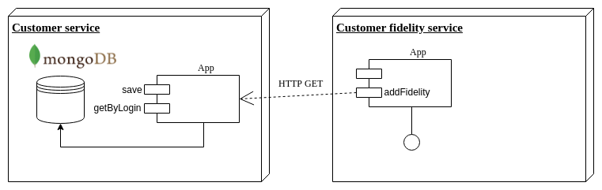

# micronaut-poc
tests on building microservices with micronaut fwk (http://micronaut.io/)

## Description
We build 2 services : customer and customerfidelity.
* **customer** exposes REST endpoints to save and get a customer. It stores the data in MongoDB and interacts with consul service discovery.
* **customerfidelity** exposes a REST endpoint to add a fidelity account to the consumer : to do that, it consumes the customer endpoint thanks to consul service discovery.



## Build and launch

Build the services : in root folder
```
cd customer && ./gradlew build && cd -
cd customerfidelity && ./gradlew build && cd -
```

Launch services on docker
```
docker-compose build
docker-compose up
```


## Test

Create a customer and persist in mongoDB :
```shell
curl -i -X POST -H "Content-Type: application/json" -d '{"login": "al.bundy@test.com", "name": "bundy", "firstName": "al", "age": 45}' 'http://localhost:8080/customers'
```

Get the created customer thanks to his login
```shell
curl -i 'http://localhost:8080/customers/al.bundy%40test.com'
```

Call the fidelity service to add an account - it calls customer service
```shell
curl -i -X POST 'http://localhost:8081/customerfidelity/al.bundy%40test.com'
```
